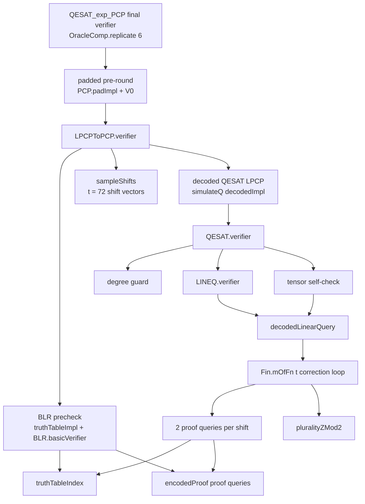

# QESAT Exponential-Length PCP Component Benchmarks

Date: 2026-05-17  
Lean: 4.28.0  
Base repo commit during measurement: `b380d75`, with the uncommitted
`qesat_component_bench` harness and result files included in this change set  
Machine: Linux x86_64, Ubuntu 22.04 kernel 6.8.0-111

This benchmarks the concrete executable `OracleComp` implementation of the
QESAT exponential-length PCP verifier. The benchmark harness is
`BlrPcp.Test.QESATComponents`, exposed as:

```bash
lake exe qesat_component_bench
```

The benchmark uses the formal public verifier composition where possible:
`LPCPToPCP.verifier ... (QESAT.verifier (n := vars))`, the theorem-level
padding wrapper, and six repetitions for the final PCP.

Some rows are exact public-composition benchmarks; others are representative
controls used to isolate private or parameterized pieces. The exact
public-composition rows are `LPCP.rawQESAT`, `PCP.preRound`,
`PCP.paddedPreRound`, and `PCP.finalRepeatedPadded` except that the theorem's
private `PCP.padImpl` is mirrored as `padImplBench`. Representative controls
include `LPCP.rawLineq`, which uses a synthetic first-variable matrix instead
of QESAT's private `linearMatrix`, and decoded-query rows that use fixed
zero shifts or all-ones query vectors. These controls are intended to isolate
the cost of the component shape, not to remeasure every private QESAT row
constructor.

## Dependency Graph



Important constants for this formalization:

- `proof_dim L = vars + vars * vars`.
- The reduction uses `q = 4` LPCP proof queries for QESAT.
- `t = LPCPToPCP.numShifts (fun _ => 4) 0 = 72`.
- One decoded LPCP proof query performs `2 * t = 144` PCP proof queries.
- A pre-round performs `3 + 2 * t * 4 = 579` PCP proof queries.
- The final verifier repeats the padded pre-round six times, so its query
  bound is `3474` PCP proof queries.

## Core Results

Representative timings are for `vars=1`, `rows=1`, `proof_dim=2` unless the
row states otherwise. Timeouts are wall-clock timeouts from `/usr/bin/time`
with `timeout`; they are censored lower bounds, not exact runtimes. Components
that timed out did not reach their internal `elapsed_ms` row, so the timeout
files record the shell wall-clock cutoff instead.

## Commands Used

The light sweep was generated with:

```bash
lake build qesat_component_bench
timeout 900 .lake/build/bin/qesat_component_bench \
  | tee benchmark_results/qesat_component_benchmarks.tsv
```

The direct full decoded-query timeout was generated with:

```bash
/usr/bin/time -f 'wall_seconds=%e exit_status=%x' \
  timeout 180 .lake/build/bin/qesat_component_bench \
  component decoded-single 1 1 1 \
  2>&1 | tee benchmark_results/qesat_component_decoded_single_v1.tsv
```

The decoded shift sweep and fixed-index control used the `decoded-t` and
`fixed-loop-t` modes:

```bash
: > benchmark_results/qesat_decoded_shift_sweep.tsv
for t in 1 8 16 32; do
  echo "### decoded-t t=$t" \
    | tee -a benchmark_results/qesat_decoded_shift_sweep.tsv
  /usr/bin/time -f 'wall_seconds=%e exit_status=%x' \
    timeout 60 .lake/build/bin/qesat_component_bench decoded-t "$t" 1 1 1 \
    2>&1 | tee -a benchmark_results/qesat_decoded_shift_sweep.tsv
done

: > benchmark_results/qesat_decoded_shift_refined.tsv
for t in 20 24 28 30; do
  echo "### decoded-t t=$t" \
    | tee -a benchmark_results/qesat_decoded_shift_refined.tsv
  /usr/bin/time -f 'wall_seconds=%e exit_status=%x' \
    timeout 60 .lake/build/bin/qesat_component_bench decoded-t "$t" 1 1 1 \
    2>&1 | tee -a benchmark_results/qesat_decoded_shift_refined.tsv
done

: > benchmark_results/qesat_fixed_loop_sweep.tsv
for t in 16 20 24 28 30; do
  echo "### fixed-loop-t t=$t" \
    | tee -a benchmark_results/qesat_fixed_loop_sweep.tsv
  /usr/bin/time -f 'wall_seconds=%e exit_status=%x' \
    timeout 60 .lake/build/bin/qesat_component_bench fixed-loop-t "$t" 1 1 1 \
    2>&1 | tee -a benchmark_results/qesat_fixed_loop_sweep.tsv
done
```

The composed heavy-component timeout file was generated with:

```bash
: > benchmark_results/qesat_heavy_component_timeouts.tsv
for component in decoded-lineq decoded-tensor decoded-qesat pre-round padded-pre-round final; do
  echo "### component=$component" \
    | tee -a benchmark_results/qesat_heavy_component_timeouts.tsv
  /usr/bin/time -f 'wall_seconds=%e exit_status=%x' \
    timeout 30 .lake/build/bin/qesat_component_bench \
    component "$component" 1 1 1 \
    2>&1 | tee -a benchmark_results/qesat_heavy_component_timeouts.tsv
done
```

The pure-control files were generated with:

```bash
: > benchmark_results/qesat_plurality_sweep.tsv
for t in 1 8 16 32 72; do
  echo "### plurality-t t=$t" \
    | tee -a benchmark_results/qesat_plurality_sweep.tsv
  /usr/bin/time -f 'wall_seconds=%e exit_status=%x' \
    timeout 60 .lake/build/bin/qesat_component_bench plurality-t "$t" 1 1 1 \
    2>&1 | tee -a benchmark_results/qesat_plurality_sweep.tsv
done

: > benchmark_results/qesat_mofn_sweep.tsv
for mode in mofn-t mofn-plurality-t; do
  for t in 1 8 16 24 32 72; do
    echo "### $mode t=$t" \
      | tee -a benchmark_results/qesat_mofn_sweep.tsv
    /usr/bin/time -f 'wall_seconds=%e exit_status=%x' \
      timeout 60 .lake/build/bin/qesat_component_bench "$mode" "$t" 1 1 1 \
      2>&1 | tee -a benchmark_results/qesat_mofn_sweep.tsv
  done
done
```

The existing optimized bit-index benchmark was generated with:

```bash
lake exe qesat_test bench | tee benchmark_results/qesat_fast_bench.txt
```

| Component | Theoretical expected work | Concrete benchmark result | Verdict |
| --- | --- | --- | --- |
| `QESAT_exp_PCP` / `PCP.finalRepeatedPadded` | Six padded pre-rounds, `3474` PCP proof queries, polynomial randomness | Timed out after 30s on `vars=1` | Blocked by decoded local-correction loop |
| `PCP.paddedPreRound` | One pre-round plus constant padding redirection | Timed out after 30s on `vars=1` | Padding is not the issue |
| `PCP.preRound` | BLR precheck, sample 72 shifts, decoded QESAT | Timed out after 30s on `vars=1` | Decoded QESAT dominates |
| `PCP.decodedQESAT` | Decode LINEQ plus tensor: 4 decoded LPCP proof queries | Timed out after 30s on `vars=1` | Dominated by first full decoded query |
| `PCP.decodedTensor` | 3 decoded LPCP proof queries, 432 PCP proof queries | Timed out after 30s on `vars=1` | Same bottleneck, multiplied by 3 |
| `PCP.decodedLineq` | 1 decoded LPCP proof query, 144 PCP proof queries | Timed out after 30s on `vars=1` | Same bottleneck |
| `PCP.decodedSingleQuery`, `t=72` | 144 PCP proof queries plus plurality over 72 answers | Timed out after 180s on `vars=1` | Primary bottleneck |
| `PCP.sampleShifts` | `t * L` random bits | 0.30ms at `L=2`; 3.0ms at `L=20` | Not problematic |
| `PCP.BLRPrecheck` | `2L` random bits plus 3 truth-table proof queries | 0ms at `L=2,6`; 0.4ms at `L=12`; 102.5ms at `L=20` | Secondary dimension-scaling cost |
| `LPCP.rawLineq` | `rows` random bits, matrix-vector work, 1 LPCP proof query | 9ms at `vars=2`, `rows=500`, `L=6` | Linear-size cost, not the final bottleneck |
| `LPCP.rawTensor` | `2vars` random bits, 3 LPCP proof queries | 0-0.1ms in the sweep | Not problematic |
| `LPCP.rawQESAT` | Degree guard + raw LINEQ + raw tensor | 14ms at `vars=2`, `rows=500`, `L=6` | Not problematic |
| Atomic proof/random queries | O(1) oracle query plus small function evaluation | 0-0.02ms in the sweep | Not problematic |
| `pure.paddingLengthPow`, `pure.paddingBoundCheck` | BigNat exponentiation/comparison for these small cases | 0ms in the sweep | Not the current bottleneck |

## Bottleneck Isolation

The bad component is not the arithmetic of QESAT, the LINEQ matrix, tensor
queries, padding, plurality alone, or truth-table index/proof evaluation alone.
The blow-up appears when the local-correction loop is represented as an
`OracleComp` built by `Fin.mOfFn` and then interpreted by `simulateQ`.

Decoded single-query timing by number of shifts, still at `vars=1`, `rows=1`,
`proof_dim=2`:

| Component | Shifts `t` | PCP proof queries | Result |
| --- | ---: | ---: | ---: |
| `PCP.decodedSingleQuery.t16` | 16 | 32 | 2ms |
| `PCP.decodedSingleQuery.t20` | 20 | 40 | 75ms |
| `PCP.decodedSingleQuery.t24` | 24 | 48 | 1.256s |
| `PCP.decodedSingleQuery.t28` | 28 | 56 | 20.110s |
| `PCP.decodedSingleQuery.t30` | 30 | 60 | timed out after 60s |
| `PCP.decodedSingleQuery.t72` | 72 | 144 | timed out after 180s |

The same shape with fixed proof indices, no `truthTableIndex (a + shift)` work,
and no meaningful proof arithmetic has essentially the same cliff:

| Component | Shifts `t` | Result |
| --- | ---: | ---: |
| `PCP.fixedIndexCorrectionLoop.t16` | 16 | 3ms |
| `PCP.fixedIndexCorrectionLoop.t20` | 20 | 45ms |
| `PCP.fixedIndexCorrectionLoop.t24` | 24 | 778ms |
| `PCP.fixedIndexCorrectionLoop.t28` | 28 | 13.782s |
| `PCP.fixedIndexCorrectionLoop.t30` | 30 | 56.159s |

Controls that stayed fast:

| Control | Result |
| --- | ---: |
| Standalone `pluralityZMod2`, `t=72` | 0ms measured, 0.16s process wall |
| Pure `Fin.mOfFn`, `t=72` | 0ms measured, 0.15s process wall |
| Pure `Fin.mOfFn` then `pluralityZMod2`, `t=72` | 0ms measured, 0.16s process wall |
| One correction step, with two proof queries and two `truthTableIndex` calls | 0ms measured in the sweep |

This isolates the practical bottleneck to the executable representation of a
long `OracleComp` correction loop, not to the mathematical number of oracle
queries. In theory `t=72` is a constant for this QESAT instantiation and the
verifier remains polynomial. In this concrete implementation, interpreting the
free-monad `OracleComp` produced by the `Fin.mOfFn` correction loop grows
roughly exponentially in `t` around the `t=20..30` range, so the formal
constant is already too large.

## Raw Files

- `benchmark_results/qesat_component_benchmarks.tsv`: light sweep of atomic,
  raw LPCP, BLR, shift sampling, and small-shift decoded components.
- `benchmark_results/qesat_decoded_shift_sweep.tsv` and
  `benchmark_results/qesat_decoded_shift_refined.tsv`: decoded single-query
  shift-count sweeps.
- `benchmark_results/qesat_component_decoded_single_v1.tsv`: direct
  `t=72` decoded single-query 180s timeout run.
- `benchmark_results/qesat_fixed_loop_sweep.tsv`: fixed-index correction-loop
  shift-count sweep.
- `benchmark_results/qesat_heavy_component_timeouts.tsv`: timeout evidence for
  decoded LINEQ, decoded tensor, decoded QESAT, pre-round, padded pre-round,
  and final verifier.
- `benchmark_results/qesat_mofn_sweep.tsv` and
  `benchmark_results/qesat_plurality_sweep.tsv`: controls.
- `benchmark_results/qesat_fast_bench.txt`: existing optimized bit-index
  benchmark for contrast.

## Conclusion

The concrete final verifier is slow because the LPCP-to-PCP local-correction
layer uses `decodedLinearQuery` with `t=72`, and the concrete `OracleComp`
execution of that correction loop is not polynomial-in-practice. The first full
decoded query already fails to complete within 180 seconds for the smallest
case. Every composed verifier above it inherits that cost.

The most promising fix is to avoid interpreting this particular `Fin.mOfFn`
correction loop through the generic free-monad `OracleComp` structure in
executable benchmarks. A specialized tail-recursive executable path, or a
different concrete representation for repeated oracle queries, should preserve
the same formal query behavior while avoiding the current exponential runtime
cliff.
